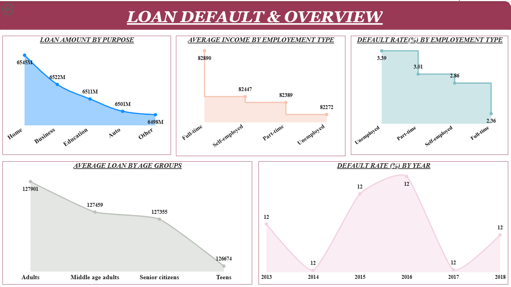
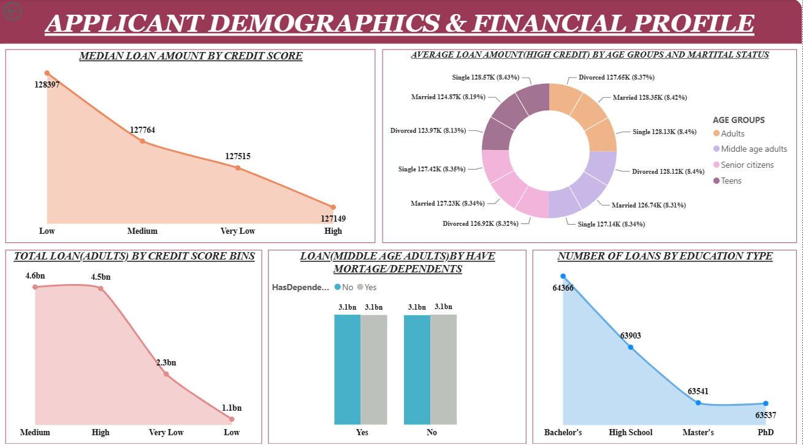
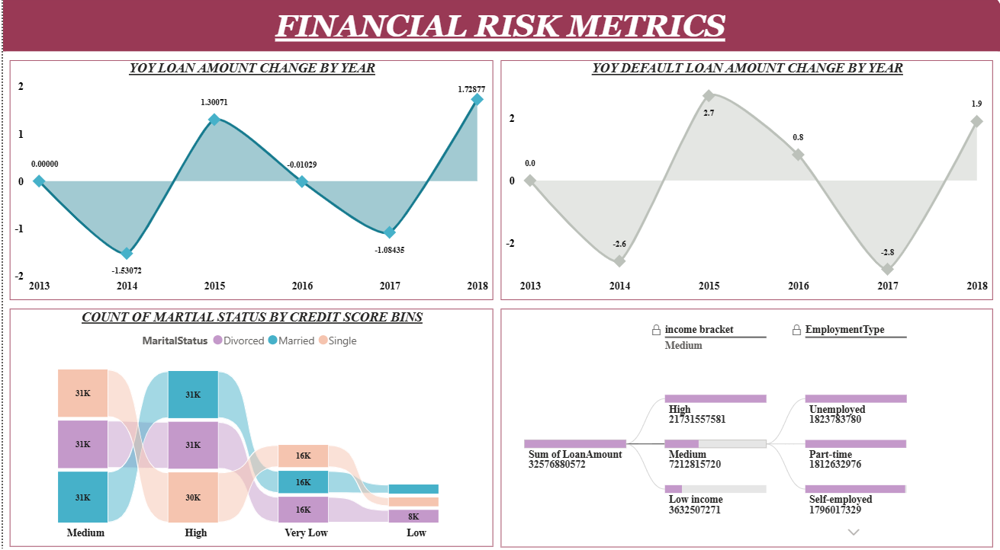

# 📊 Loan Default Analysis Dashboard

## 📌 Project Overview

The Loan Default Analysis Dashboard is an interactive Business Intelligence solution built using **Power BI, SQL, Power Query, DAX, and Microsoft Excel**. The project analyzes **255,347 loan records** across **19 attributes** to evaluate loan performance, borrower demographics, credit risk, and default trends through interactive dashboards and business metrics.

---

# 🎯 Problem Statement

Financial institutions generate large volumes of loan data that require continuous analysis to understand borrower behavior, monitor loan performance, and identify potential default trends. Manual analysis is time-consuming and often fails to provide timely insights.

This dashboard provides an interactive platform to analyze:

- Loan Distribution
- Borrower Demographics
- Default Rate
- Credit Score Analysis
- Employment Type Analysis
- Income Analysis
- Financial Risk Metrics
- Year-over-Year (YoY) Loan Growth

---

# 📂 Dataset Information

| Attribute | Details |
|-----------|---------|
| Dataset | Loan Default Dataset |
| Records | 255,347|
| Columns | 19 |
| File Type | CSV |

---

# 🛠 Technologies Used

- Power BI Desktop
- SQL
- Power Query
- DAX
- Microsoft Excel

---

# 🔄 Project Workflow

### Step 1
Imported the Loan Default dataset (CSV) into SQL for data cleaning and validation.

### Step 2
Performed data quality checks by identifying:

- Missing values
- Duplicate records
- Incorrect data types
- Data inconsistencies

### Step 3
Imported the cleaned dataset into Power BI Desktop.

### Step 4
Used Power Query for data transformation, validation, and data modeling.

### Step 5
Enabled Column Quality, Column Distribution, and Column Profile to assess overall data quality.

### Step 6
Created calculated columns and DAX measures to support business analysis and interactive reporting.

### Step 7
Developed a **3-page interactive Power BI dashboard** featuring business metrics, slicers, drill-through navigation, and interactive visualizations.

### Step 8
Published the report to **Power BI Service**.

---

# 📈 Dashboard Pages

## 📄 Page 1 – Loan Default Overview

Dashboard includes:

- Loan Amount by Purpose
- Average Income by Employment Type
- Default Rate by Employment Type
- Average Loan Amount by Age Group
- Default Rate by Year

---

## 📄 Page 2 – Applicant Demographics & Financial Profile

Dashboard includes:

- Median Loan Amount by Credit Score
- Average Loan Amount by Age Group & Marital Status
- Total Loan Amount by Credit Score
- Loan Distribution by Dependents
- Number of Loans by Education Level

---

## 📄 Page 3 – Financial Risk Analysis

Dashboard includes:

- Year-over-Year Loan Amount Growth
- Year-over-Year Default Loan Growth
- Credit Score vs Marital Status Analysis
- Income Bracket Analysis using Decomposition Tree

---

# 📊 Dashboard Metrics

The dashboard provides analysis of:

- Total Loan Amount
- Average Loan Amount
- Default Rate
- Average Income
- Median Loan Amount
- Year-over-Year Loan Growth
- Year-over-Year Default Loan Growth

---

# 📉 Key Insights

- Employment status is a strong predictor of loan default, with unemployed borrowers showing the highest default rate.
- Borrowers with higher education levels consistently demonstrate lower default rates.
- Loans with a co-signer exhibit a significantly lower default rate than those without a co-signer.
- Borrowers with both a mortgage and dependents show the lowest default risk.
- Loan purpose has minimal impact on total loan distribution, indicating it is a weaker standalone risk indicator.

---

# ✨ Features

- Interactive Slicers
- Drill-through Navigation
- Cross-filtering Between Visuals
- Dynamic DAX Measures
- Multiple Chart Types
- Decomposition Tree Analysis

---

# 📚 Skills Demonstrated

- Data Cleaning & Validation
- SQL Querying
- Power Query
- Data Modeling
- DAX
- Dashboard Development
- Data Visualization
- Credit Risk Analysis

---

# 📌 Conclusion

This project demonstrates an end-to-end Business Intelligence workflow by analyzing **255,347 loan records** using **SQL, Power Query, DAX, and Power BI**. It showcases data cleaning, transformation, modeling, and interactive dashboard development to identify loan default patterns, borrower behavior, and financial risk factors through business-focused visual analytics.
